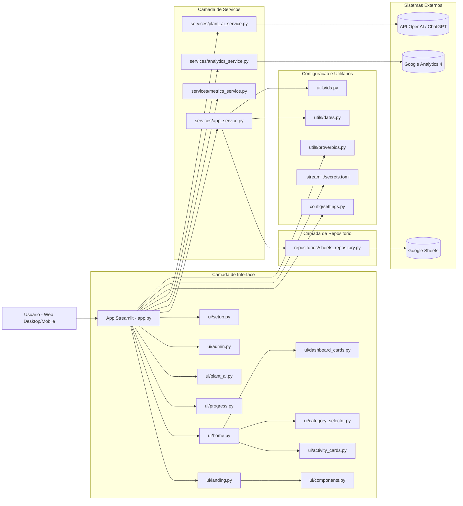

# Arquitetura da Solucao - CuidaFacil

## Visao Geral

O CuidaFacil foi construido em arquitetura modular, com interface em Streamlit, camada de servicos para regras de negocio e integracoes externas para persistencia, analytics e IA.

## Desenho da Arquitetura

## Responsabilidades por Camada

- Interface (`ui/`): renderizacao de telas, cards e experiencia do usuario.
- Servicos (`services/`): validacoes, fluxo de negocio, calculos de metricas e orquestracao de integracoes.
- Repositorio (`repositories/`): leitura/escrita no Google Sheets.
- Configuracao (`config/`, `.streamlit/`): credenciais, segredos e parametros do app.
- Utilitarios (`utils/`): funcoes auxiliares de data, id e conteudo estatico.

## Fluxos Principais

### 1. Login/Cadastro

1. Usuario informa e-mail na sidebar.
2. `app.py` chama `services/app_service.py`.
3. Servico consulta `repositories/sheets_repository.py`.
4. Dados sao lidos/gravados no Google Sheets.

### 2. Criacao e Conclusao de Atividades

1. Usuario cria agendamento em `ui/home.py`.
2. `services/app_service.py` valida frequencia/datas.
3. Persistencia acontece em Google Sheets.
4. Conclusoes alimentam progresso e metricas.

### 3. Progresso e Admin

1. Progresso do usuario e calculado por `services/app_service.py`.
2. Dashboard admin usa `services/metrics_service.py`.
3. Eventos de uso podem ser enviados ao GA4 via `services/analytics_service.py`.

### 4. Cuidador IA de Plantas

1. Usuario preenche contexto em `ui/plant_ai.py`.
2. `services/plant_ai_service.py` monta prompt e chama API OpenAI.
3. Resposta volta para exibicao no app.

## Consideracoes de Escalabilidade

- Cache em leitura de planilhas (`st.cache_data`) para reduzir latencia e chamadas repetidas.
- Separacao por camadas para facilitar manutencao e evolucao de funcionalidades.
- Possivel evolucao futura: trocar persistencia Google Sheets por banco relacional sem alterar a camada de UI.
